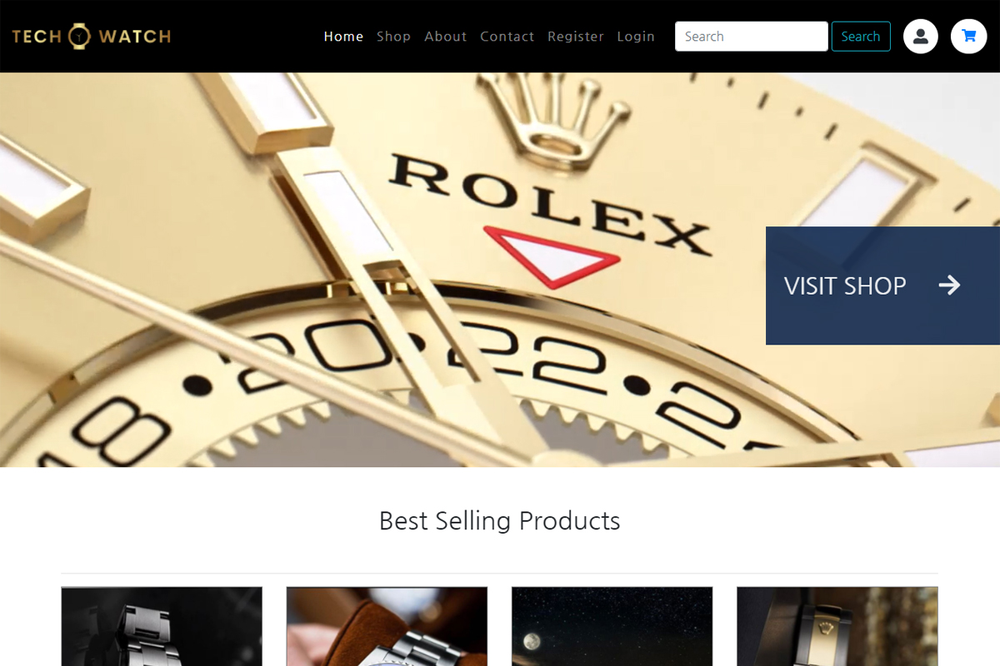

# E-commerce project - TechWatch

[Link to Demo](http://watches.alexandrpasko.com/)

TechWatch - e-commerce - is a database driven, dynamically generated multi-page website where people can search for brand watches and buy them online. The website is created on PHP MVC framework, which makes the code easy to navigate and maintain. Layout of the website is based on Bootstrap template. There is also an admin website where a user with administrative rights has access to full CRUD. 

## Technologies/Languages:
* Laravel (PHP MVC)
* Bootstrap
* Ajax
* MySQL

## Screenshot:
